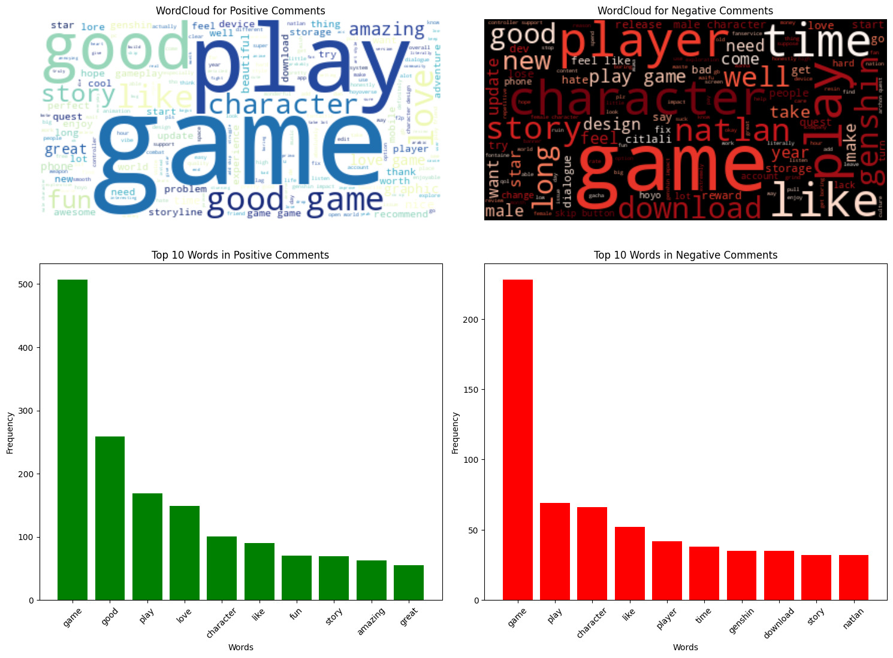
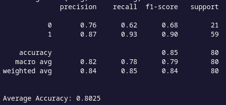

## Nama : Muhammad Faris Assami
## NIM  : A11.2022.14647
## Kelas: STKI-A11-4701
---
### https://mfarisa-system-retrieval-informat-stki-a112214647-uasapp-onmwem.streamlit.app/
---
# Deteksi Sentimen pada Ulasan Game Genshin Impact di Google Play Store

### **Ringkasan**:
Proyek ini bertujuan untuk menganalisis ulasan pengguna aplikasi **Genshin Impact** yang ada di Google Play Store dengan mendeteksi sentimen dari teks ulasan dan mengklasifikasikannya menjadi **positif** atau **negatif** menggunakan **model XGBoost**.

### **Permasalahan**:
- **Bagaimana mendeteksi sentimen berdasarkan teks ulasan yang diberikan?**
  - Masalah ini dipecahkan dengan menggunakan **model XGBoost** yang dilatih untuk mengklasifikasikan ulasan menjadi dua kategori: positif dan negatif.
- **Bagaimana meningkatkan akurasi deteksi dengan menggabungkan **model XGBoost** dan deteksi berbasis kata kunci?**
  - Deteksi berbasis kata kunci digunakan untuk meningkatkan akurasi model dengan menambahkan fitur penting berupa kata-kata yang menunjukkan sentimen positif dan negatif, yang kemudian diproses menggunakan **model XGBoost**.

### Tujuan:
- **Membangun sistem untuk mendeteksi apakah sentimen ulasan adalah positif atau negatif menggunakan **model XGBoost**.
- **Menggunakan kata-kata kunci sebagai fitur tambahan dalam proses deteksi sentimen.**

### **Model / Alur Penyelesaian (Bagan)**:
```
1. Data Collection -> 2. Data Cleaning & Preprocessing -> 3. Feature Engineering -> 
4. Deteksi Sentimen Berdasarkan Kata Kunci -> 5. Model Training (XGBoost) -> 6. Model Evaluation -> 7. Sentiment Detection
```

---
## Struktur File

1. **serpAPI.ipynb**: Mengambil ulasan aplikasi dari Google Play Store menggunakan `google_play_scraper`.
2. **pre-process.ipynb**: Mempersiapkan data yang diambil dengan membersihkan dan memproses teks, membuat word clouds, dan melatih model pembelajaran mesin untuk klasifikasi sentimen.
3. **predict.ipynb**: Menggunakan model yang dilatih untuk memprediksi sentimen dari input teks baru.

---

### **Exploratory Data Analysis (EDA)**:
- **Distribusi Rating**: Menganalisis distribusi rating untuk mengetahui seberapa banyak ulasan positif dan negatif yang diberikan.
- **Frekuensi Kata**: Menganalisis kata-kata yang sering muncul dalam ulasan untuk mengidentifikasi sentimen yang dominan.
- **Pembersihan Data**: Menghapus duplikat, menangani nilai kosong pada kolom `response`, dan melakukan tokenisasi pada kolom `snippet`.

### **Proses Feature Dataset**:
- **Penyaringan Kata Kunci**: Menambahkan fitur berbasis deteksi kata kunci yang menunjukkan sentimen positif atau negatif.
- **TF-IDF Vectorization**: Menggunakan teknik **TF-IDF** (Term Frequency-Inverse Document Frequency) untuk mengubah teks menjadi fitur numerik yang dapat digunakan oleh model.

---

## Proses Learning / Modeling

Pada tahap ini, kami melatih **model XGBoost** untuk mengklasifikasikan ulasan menjadi dua kategori: **positif** dan **negatif**.

- **Model yang Digunakan**: **XGBoost** dipilih karena kemampuannya dalam menangani data tidak terstruktur dan memberikan hasil yang cepat serta akurat.
- **Pembagian Data**: Dataset dibagi menjadi data pelatihan dan data pengujian dengan proporsi 80%-20% untuk melatih dan menguji model.
- **Pelatihan Model**: Model **XGBoost** dilatih menggunakan data pelatihan yang telah diolah dan diproses.

---

## 1. `serpAPI.ipynb` - Mengambil Ulasan

Notebook ini mengambil ulasan dari aplikasi **Genshin Impact** di Google Play Store menggunakan pustaka `google_play_scraper`.

### Penjelasan Kode:
- **Impor Pustaka**: Notebook ini mengimpor modul `csv` untuk menyimpan data dan pustaka `google_play_scraper` untuk mengambil ulasan aplikasi.
- **Mengambil Ulasan**: Fungsi `reviews()` digunakan untuk mengumpulkan 1000 ulasan aplikasi Genshin Impact dari Google Play Store, dengan parameter yang menentukan ID aplikasi (`com.miHoYo.GenshinImpact`), bahasa (`en`), dan negara (`us`).
- **Menyimpan Data**: Ulasan disimpan dalam file CSV (`genshin_impact_reviews.csv`). Kolom dalam CSV ini mencakup:
  - `id`
  - `title`
  - `avatar`
  - `rating`
  - `snippet`
  - `likes` 
  - `date` 
  - `iso_date`
  - `response`

### Output:
Ulasan disimpan dalam file CSV bernama `genshin_impact_reviews.csv`.

---

## 2. `pre-process.ipynb` - Pra-pemrosesan dan Pelatihan Model

Notebook ini memproses ulasan yang diambil, membersihkan teks, dan melatih model analisis sentimen.

### Penjelasan Kode:
- **Memuat Data**: Memuat data ulasan dari file `genshin_impact_reviews.csv`.
- **Pra-pemrosesan Teks**:
  - Menghapus karakter yang tidak perlu (misalnya simbol khusus, URL).
  - Men-tokenisasi teks ulasan dan menghapus kata-kata umum (stopwords).
  - Melakukan lemmatization untuk mengubah kata menjadi bentuk dasar.
  - Melakukan Augmentasi untuk menangani masalah ketidakseimbangan kelas pada dataset. 
- **Visualisasi**:
  - **WordCloud**: Membuat word clouds untuk memvisualisasikan kata-kata yang paling sering muncul pada komentar positif dan negatif.
  - **Bar Plot**: Membuat bar plot untuk menunjukkan 10 kata paling sering dalam komentar positif dan negatif.
- **Pelatihan Model**:
  - **TfidfVectorizer**: Mengubah teks yang sudah dibersihkan menjadi fitur numerik (nilai TF-IDF).
  - **Model XGBoost**: Melatih model klasifikasi sentimen menggunakan **XGBoost** (algoritma gradient boosting).
- **Menyimpan Model**:
  - Menyimpan model yang telah dilatih (`xgb_model.pkl`).
  - Menyimpan vectorizer (`vectorizer.pkl`) yang digunakan untuk mengubah data input baru.

### Output:
Model yang dilatih dan vectorizer disimpan dalam file `.pkl`.

---

## 3. `predict.ipynb` - Prediksi

Notebook ini menggunakan model yang dilatih dan vectorizer untuk memprediksi sentimen dari input teks baru.

### Penjelasan Kode:
- **Memuat Model dan Vectorizer**: Memuat model XGBoost yang dilatih (`xgb_model.pkl`) dan vectorizer (`vectorizer.pkl`) dari file `.pkl`.
- **Prediksi**:
  - Menerima input teks baru (misalnya, "good graphic").
  - Mengubah input menggunakan vectorizer.
  - Membuat prediksi menggunakan model yang dilatih (sentimen positif atau negatif).
- **Output**:
  - Menampilkan sentimen (positif atau negatif) dari teks yang diberikan.

### Output:
Hasil prediksi ditampilkan dalam sel output yang menunjukkan sentimen untuk teks yang diberikan.

---

## Penjelasan Dataset

Dataset ini terdiri dari ulasan pengguna untuk aplikasi **Genshin Impact** yang diambil dari Google Play Store. Dataset disimpan dalam format CSV dengan kolom-kolom berikut:

- **id**: ID unik untuk setiap ulasan.
- **title**: Nama pengguna yang memberikan ulasan.
- **avatar**: Gambar avatar pengguna (tidak tersedia dalam dataset).
- **rating**: Rating yang diberikan oleh pengguna (dari 1 hingga 5 bintang).
- **snippet**: Isi teks dari ulasan.
- **likes**: Jumlah suka yang diterima ulasan.
- **date**: Tanggal dan waktu ulasan diposting.
- **iso_date**: Tanggal dalam format ISO 8601.
- **response**: Tanggapan pengembang terhadap ulasan (jika ada).

Contoh dari dataset:

| id                                | title                  | rating | snippet                                                                 | likes | date                  | response                      |
|-----------------------------------|------------------------|--------|-------------------------------------------------------------------------|-------|-----------------------|-------------------------------|
| 45b29182-3368-445f-8353-efc25383ea9f | Francesca Ashley Inguito | 1      | This was awful, the dialogue of characters in the game was terrible.   | 1     | 2025-01-12 17:37:21   | NaN                           |
| 5baab1b9-0540-4ac3-90c9-1ee3462bdc73 | Ikmal Hariz            | 5      | MANYAK BAGUS LA I LIKE CUMA PLS CEPAT KAN SIKIT                       | 0     | 2025-01-12 02:42:05   | NaN                           |

---

## Visualisasi

Di bawah ini adalah visualisasi dari analisis sentimen pada komentar positif dan negatif menggunakan word clouds dan bar plots.



---

## Prasyarat

Untuk menjalankan notebook-notebook ini, Anda perlu menginstal pustaka Python berikut:
- `pandas`
- `numpy`
- `scikit-learn`
- `imbalanced-learn`
- `spacy`
- `nltk`
- `xgboost`
- `emoji`
- `matplotlib`
- `wordcloud`
- `google-play-scraper`

Anda dapat menginstalnya menggunakan perintah berikut:
```bash
pip install pandas numpy scikit-learn imbalanced-learn spacy nltk xgboost emoji matplotlib wordcloud google-play-scraper
```

---

## Menjalankan Proyek

1. Mulailah dengan menjalankan `serpAPI.ipynb` untuk mengambil ulasan dan menyimpannya sebagai CSV.
2. Kemudian jalankan `pre-process.ipynb` untuk memproses ulasan dan melatih model analisis sentimen.
3. Terakhir, jalankan `predict.ipynb` untuk membuat prediksi sentimen pada teks baru.

---

## Performa Model


---

## Diskusi Hasil dan Kesimpulan

### **Diskusi Hasil**  
Berdasarkan hasil evaluasi model menggunakan metrik seperti *precision*, *recall*, dan *F1-score*, kinerja model XGBoost dalam mendeteksi sentimen ulasan dapat dianggap memadai dengan *accuracy* sebesar **85%**. Secara lebih rinci:  

- Sentimen negatif (*label 0*) memiliki *precision* sebesar **0.76**, *recall* sebesar **0.62**, dan *F1-score* sebesar **0.68**. Hal ini menunjukkan bahwa model kurang optimal dalam mengidentifikasi ulasan negatif, terutama dalam menangkap semua ulasan negatif (*recall rendah*).  
- Sentimen positif (*label 1*) menunjukkan performa yang lebih baik, dengan *precision* sebesar **0.87**, *recall* sebesar **0.93**, dan *F1-score* sebesar **0.90**. Ini mengindikasikan bahwa model mampu mendeteksi sentimen positif dengan lebih akurat dan konsisten.  

Nilai rata-rata makro (*macro avg*) menunjukkan *F1-score* sebesar **0.79**, sedangkan rata-rata berbobot (*weighted avg*) menghasilkan nilai **0.84**, menegaskan bahwa model lebih unggul dalam menangani ulasan positif dibandingkan ulasan negatif.  

Secara keseluruhan, model menunjukkan kinerja yang baik, namun ada ruang untuk peningkatan, terutama dalam mendeteksi ulasan negatif. Penyebabnya mungkin terkait dengan ketidakseimbangan data (*imbalance*) atau fitur yang kurang representatif untuk sentimen negatif.

### **Kesimpulan**  
Proyek ini berhasil mengimplementasikan **model XGBoost** untuk mendeteksi sentimen ulasan pengguna **Genshin Impact** di Google Play Store. Hasil evaluasi menunjukkan bahwa model bekerja lebih baik dalam mengklasifikasikan ulasan dengan sentimen positif dibandingkan sentimen negatif, seperti yang ditunjukkan oleh *precision*, *recall*, dan *F1-score* yang lebih tinggi pada kategori positif.  

Dengan akurasi sebesar **85%** dan *F1-score* rata-rata **0.79**, model ini memberikan wawasan berharga kepada pengembang tentang sentimen pengguna terhadap game mereka. Namun, performa deteksi pada ulasan negatif dapat ditingkatkan lebih lanjut dengan menyeimbangkan dataset atau meningkatkan tahap pra-pemrosesan data.  

Hasil ini menunjukkan potensi penerapan model serupa dalam analisis ulasan untuk aplikasi atau produk lainnya, dengan penyesuaian sesuai kebutuhan data.


